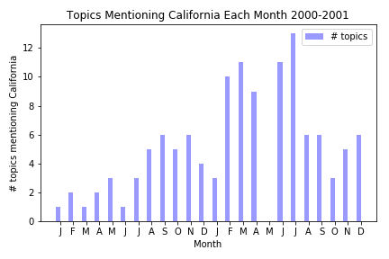

# Topic Analysis of the Enron Email Corpus  
## _The Problem of a Big, Rapidly Changing Corpus_

**Jim McGugan**


## Problem

*Email!* Can't live with it; can't live without it. It's the bane of corporate life. Most large organizations run on email. [One study](https://www.huffingtonpost.com/entry/check-work-email-hours-survey_us_55ddd168e4b0a40aa3ace672) found American workers spend 6.3 hours per day on email. [Another study](https://mashable.com/2012/08/01/email-workers-time/#gTF9bAOY2EqD) pegs it at only 28% of workers' time.

Email has certainly been much studied by the Data Science community, but most studies have focused on [spam detection](https://en.wikipedia.org/wiki/Naive_Bayes_spam_filtering). A problem with non-spam analysis of email is that most corporations and government departments do not want to make their email troves available for analysis as they contain sensitive information.

A pleasant exception to the non-availability of good email samples is the [Enron dataset](http://www.cs.cmu.edu/~./enron/) which has entered the public domain as a result of Enron's collapse and the resulting criminal investigation of the company. The dataset includes over half a million emails exchanged by 150 employees of Enron. The [Wikipedia article](https://en.wikipedia.org/wiki/Enron_Corpus) on it comments *"The corpus is unique in that it is one of the only publicly available mass collections of real emails easily available for study, as such collections are typically bound by numerous privacy and legal restrictions which render them prohibitively difficult to access."*

The Enron dataset is well-known in the Data Science community but much of the study of it has emphasized [fraud detection](https://linkurio.us/blog/investigating-the-enron-email-dataset/). It has recently been imported as a [Kaggle dataset](https://www.kaggle.com/wcukierski/enron-email-dataset) but relatively little analysis beyond basic exploration has yet been performed on it.

### Generalization of the Study

More generally, this study looks at what the data scientist can do with a dataset that is:
* big,
* rapidly changing, and
* and about many, disparate topics

This occurs not just in email, but in all social media (Facebook, Twitter, etc.) as well as news feeds. Presumably the topics change over time.

### Main questions

1. Can we discern topics in the email traffic that are meaningful?

2. Do these topics change over time?

We propose to analyze the Enron dataset less from the fraud perspective and more from the prospective that these are real emails exchanged within a single corporation as part of the daily life of that corporation.

## Exploratory Data Analysis

### Parsing Emails
The corpus consists of over 500,000 emails, mainly covering a two year period 2000-2001.

The EDA began in a notebook, where I worked out how to parse the emails to extract To, From, Subject, and content. I stored the results in a dataframe.

### Competing NLP Packages in Python
I looked at:
* NLTK
* Textblob
* SpaCy
* Stanford NLP
* gensim

Gensim is the best for topic analysis. I wound up using NLTK for tokenization, stemming, lemming, etc. but models from gemsim.

### Evaluating Different Models
I experimented with various techniques:
* KMeans clustering
* PCA
* Latent Semantic Analysis (LSA) (a variant on SVD)
* Latent Dirichlet Allocation (LDA)

LDA gave the most interpretable clusters. In addition, pyLDAvis is a wonderful  tool for visualizing the results of an LDA model.

### Evaluating Different Cluster Sizes

Initially I sought quite small numbers of clusters (4, 8…), thinking I wanted the "top" topics. This works, giving clusters with good cohesion and good inter-topic separation. Unfortunately it does not yield insights. In most time periods I looked at, the top running topic was Enron employees talking about…Enron.

I increased num_clusters by quite a lot, eventually settling on 400. This yields a lot of mid-ranked clusters which seem to be about real topics that you can understand and potentially interesting.

In principle, I should have carefully walked my cluster sizes over a wide range and attempted to find an optimum (Silhouette score, etc.) Unfortunately, with over half a million emails, it takes a long time to run the models and this limits how many different cluster sizes you can look at.

## Making an "Interruptible" Pipeline

Eventually I transitioned from the notebook to .py files.

One thing that became apparent during the EDA was that it takes a long time to do anything with half a million documents so it is important to write a pipeline that stores intermediate results in files so that they can be reused without having to go back to the start.

### Stage 1: Parse Emails to Dataframe

The source emails look like this:
```
Message-ID: <10473497.1075855728819.JavaMail.evans@thyme>
Date: Tue, 9 Jan 2001 03:06:00 -0800 (PST)
From: phillip.allen@enron.com
To: stagecoachmama@hotmail.com
Subject:
Cc: gallen@thermon.com
Mime-Version: 1.0
Content-Type: text/plain; charset=us-ascii
Content-Transfer-Encoding: 7bit
Bcc: gallen@thermon.com
X-From: Phillip K Allen
X-To: stagecoachmama@hotmail.com
X-cc: gallen@thermon.com
X-bcc:
X-Folder: \Phillip_Allen_June2001\Notes Folders\'sent mail
X-Origin: Allen-P
X-FileName: pallen.nsf

Lucy,

Here is a schedule of the most recent utility bills and the overages.  There
are alot of overages.  It will probably get worse this month because of all
the cold weather.

You need to be very clear with all new tenants about the electricity cap.  
This needs to be handwritten on all new leases.

I am going to fax you copies of the bills that support this spreadsheet.  We
also need to write a short letter remind everyone about the cap and the need
to conserve energy if they don't want to exceed their cap.  I will write
something today.


Wait until you have copies of the bills and the letter before you start
collecting.

Phillip
```
The source data is in standard email format, i.e. a multipart format with To, From, Subject… metadata plus a possibly multipart MIME payload. This was parsed to a "wide" dataframe with separate columns for To, From, content, etc.

The wide dataframe was stored to an intermediate csv file.


### Stage 2: Make time sequenced corpora

The wide dataframe was read from disk and sorted by date. The emails were then broken into consecutive time periods. Although the code I wrote could use any time period (day, week, month, quarter…), I opted to break it into months.

For each month, the body of each email sent during that month was converted to a corpus and accompanying dictionary file. To do this, the text was tokenized, stripped of stopwords and punctuation, stemmed, and lemmatized.

As an additional step, all words that occur only once in the corpus were eliminated. These are valuable for search but useless for topic clustering.

Finally, all words were converted to unique integer IDs and the resulting corpus file written to disk. The dictionary that contains the integer ID to original word mapping was also written.

The result was 24 pairs of files, a corpus and dictionary for every month from Jan 2000 through Dec 2001.

### Stage 3: Make Models

For each time period, the corpus and dictionary files created in the previous step were read and a model created. Based on the EDA, we focused on LDA models.

The resulting models were again saved to disk.

### Stage 4: Make Visualizations

For each model file, pyLDAvis was run to prepare a visualization. The visualization was saved to disk as an html file.

### Observations about the Pipeline

1. It takes a long time to generate a corpus and dictionary—longer in fact than to generate an LDA model from the corpus and dictionary. Given that corpus files tend to not change once you have tuned the tokenization process, it is a big time saving to keep them around. This facilitates tinkering with model hyperparameters.

2. It takes a long time to generate a pyLDAvis visualization from an LDA model. It is good to save it.

## Analysis

## Can we discern meaningful topics?

_Yes!_ Look at January 2001:


Seems like there was a lot of discussion about energy and power markets in California.

For those of you with short memories, California had a [power crisis](https://en.wikipedia.org/wiki/California_electricity_crisis) during 2000 and 2001, with Enron accused of rigging energy markets to cheat California and enrich themselves. From the Wikipedia article:

>The California electricity crisis, also known as the Western U.S. Energy Crisis of 2000 and 2001, was a situation in which the United States state of California had a shortage of electricity supply caused by market manipulations, and capped retail electricity prices.[5] The state suffered from multiple large-scale blackouts, one of the state's largest energy companies collapsed, and the economic fall-out greatly harmed Governor Gray Davis' standing.
>
>Drought, delays in approval of new power plants,[5]:109 and market manipulation decreased supply.[citation needed] This caused an 800% increase in wholesale prices from April 2000 to December 2000.[6]:1 In addition, rolling blackouts adversely affected many businesses dependent upon a reliable supply of electricity, and inconvenienced a large number of retail consumers.
>
>California had an installed generating capacity of 45 GW. At the time of the blackouts, demand was 28 GW. A demand supply gap was created by energy companies, mainly **Enron**, to create an artificial shortage. Energy traders took power plants offline for maintenance in days of peak demand to increase the price.[7][8] Traders were thus able to sell power at premium prices, sometimes up to a factor of 20 times its normal value. Because the state government had a cap on retail electricity charges, this market manipulation squeezed the industry's revenue margins, causing the bankruptcy of Pacific Gas and Electric Company (PG&E) and near bankruptcy of Southern California Edison in early 2001.[6]:2-3
>
>The financial crisis was possible because of partial deregulation legislation instituted in 1996 by the California Legislature (AB 1890) and Governor Pete Wilson. **Enron took advantage of this deregulation and was involved in economic withholding and inflated price bidding in California's spot markets.**[9]
>
>The crisis cost between US$40 to $45 billion.

And, indeed, we can see the number of topic clusters mentioning California rises with the crisis:


